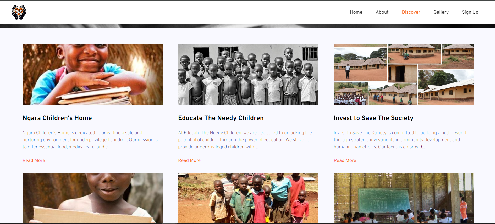
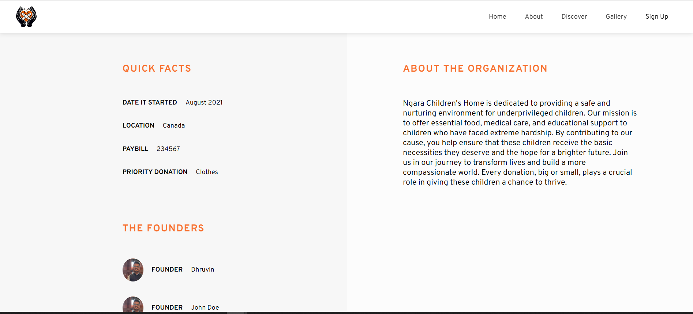
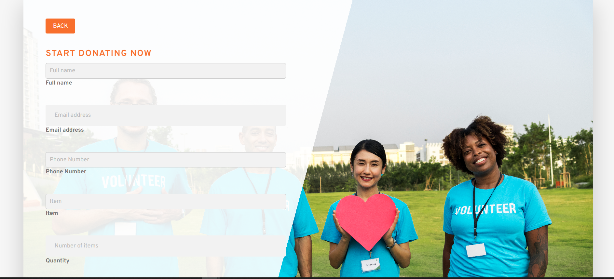
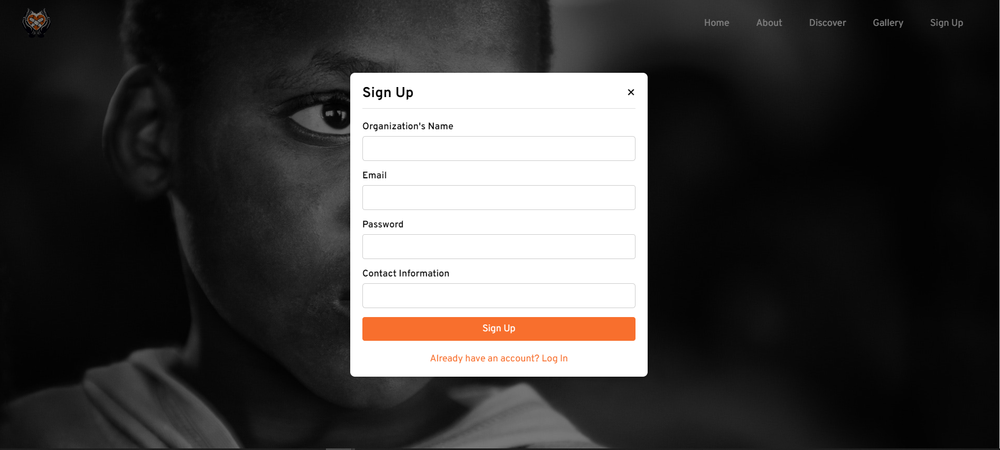
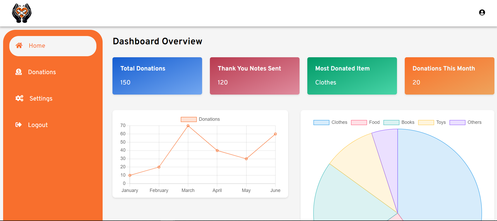
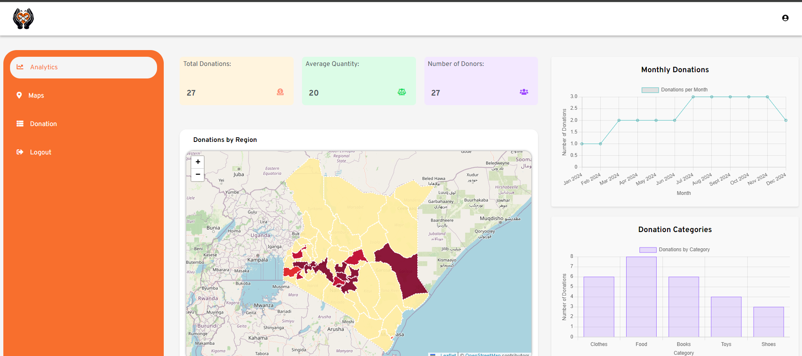

# Generous Hands

Generous Hands is a donation platform that connects individuals looking to donate physical items with organizations in need. The platform also provides admin functionalities for monitoring donations and an organization dashboard for managing content and tracking donations.

 <!-- Main Image of the Project -->
## Features

- **User Donation of Physical Items:** Users can easily donate items from their homes.
- **Admin Monitoring of Donations:** Admins have tools to view and manage donations.
- **Organization Signup for Donations:** Organizations can sign up to receive donations.
- **Organization Dashboard:** Organizations can manage their content and view associated donations.

## Installation

To get started with Generous Hands, follow these steps:

1. **Clone the repository:**
   ```bash
   git clone https://github.com/Murags/Generous-Hands.git
   ```
2. **Navigate into project folder:**
   ```
    cd Generous-Hands
   ```
3. **Install the dependencies:**
   ```
    npm install
    ```
4. **Start the development server:**
   ```
    npm start
    ```

## Usage

### User
Discover Charitable Organizations: Users can navigate to the Discover Page to view a list of charitable organizations.

Go to the Discover Page.

Browse through the list of organizations.
Read More About an Organization: Users can click on the "Read More" button to view detailed information about a specific organization.

Click the Read More button on the Discover Page.

View additional details about the organization.

Donate Items: Users can navigate to the donation page by clicking the donate button at the bottom of the page, fill out the form with item details, and submit their donations.

Go to the Donation Page.

Fill out the form with the item details.
Click Submit to complete your donation.

### Organization
Sign Up: Organizations can sign up by providing their name, email, password, and contact information.


Go to the Sign Up Page.
Enter your organization’s name, email, password, and contact information.

Click Sign Up to create your organization account.
Dashboard: Organizations can manage their content and view donations through their dashboard.

After signing up, log in to access the Organization Dashboard.
Manage your content and view the donations associated with your organization.



### Admin
Monitor Donations: Admins can view and manage all donations made through the platform.

Log in as an admin to access the Admin Monitoring Page.
View and manage donations from the admin panel.


## Technologies
Generous Hands is built using:

React: A JavaScript library for building user interfaces.
